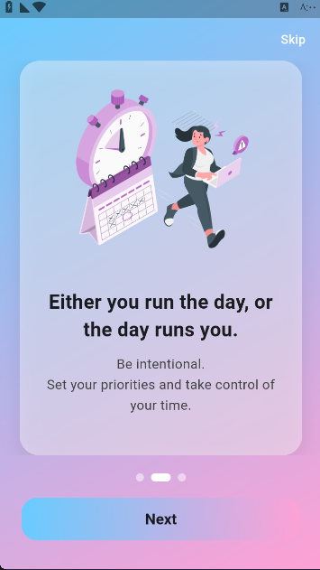
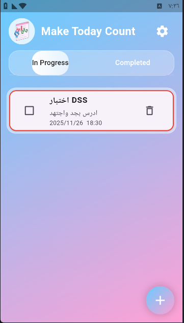
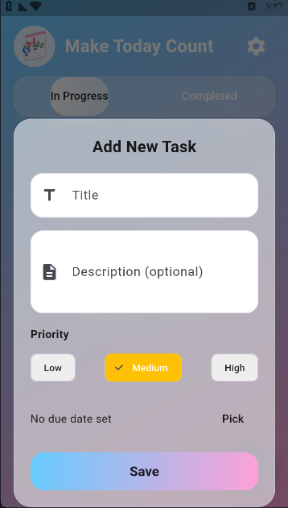
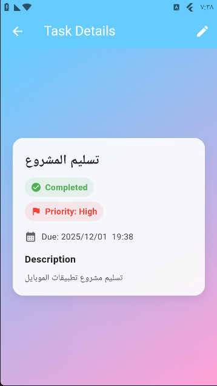
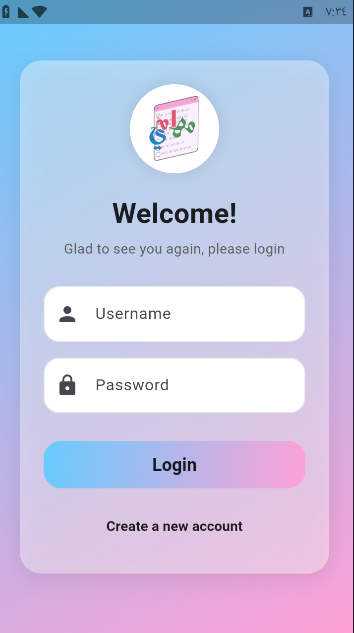
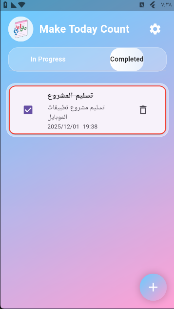

# Mahami-Task-Management-App
 Efficient task management with local data storage and scheduled notifications. The app follows clean architecture principles with a well-structured folder organization, showcasing solid Flutter development practices.


## ✨ Features

* Add, edit, and delete tasks
* Schedule task reminders with local notifications
* Persist tasks locally using device storage
* Arabic (RTL) and English (LTR) support
* Custom UI theme with Google Fonts
* Splash screen & onboarding experience
* Login & Register UI
* Settings screen


## 🛠️ Technologies Used

* Flutter
* Provider – State Management
* SharedPreferences – Local Data Persistence
* flutter_local_notifications – Task Reminders
* timezone – Timezone-aware scheduling
* Google Fonts – Custom Typography


## 📂 Project Structure

```bash

lib/
│
├── models/
│   └── task.dart
│
├── providers/
│   ├── notifications_provider.dart
│   ├── settings_provider.dart
│   └── tasks_provider.dart
│
├── screens/
│   ├── home_screen.dart
│   ├── login_screen.dart
│   ├── onboarding_screen.dart
│   ├── register_screen.dart
│   ├── settings_screen.dart
│   ├── splash_screen.dart
│   └── task_details_screen.dart
│
├── widgets/
│   ├── task_form.dart
│   └── task_item.dart
│
└── main.dart
```


## Architecture Overview

The application follows a layered structure:

* **Models** → Data representation
* **Providers** → Business logic & state management
* **Screens** → UI pages
* **Widgets** → Reusable UI components

State management is handled using Provider, separating UI from logic and ensuring maintainability and scalability.


## Getting Started

###  Clone the repository

```bash
git clone https://github.com/RinadSalem/maham i.git
cd mahami
```

### Install dependencies

```bash
flutter pub get
```

###  Run the app

```bash
flutter run
```


##  Screenshots

| Onboarding | Home Active | Add Task |
|-------------|--------------|---------|
|  |  |  |
| Task Details | Login Screen | Home Completed |
|  |  |  |


##  Future Improvements

*  Dark Mode
*  Cloud synchronization
*  Productivity analytics
*  Real authentication backend
*  Task categories & filters


##  Developer

Developed as a Flutter project for a core university subject to demonstrate:

- State management
- Local persistence
- Notifications scheduling
- Clean folder architecture
- RTL/LTR UI support

